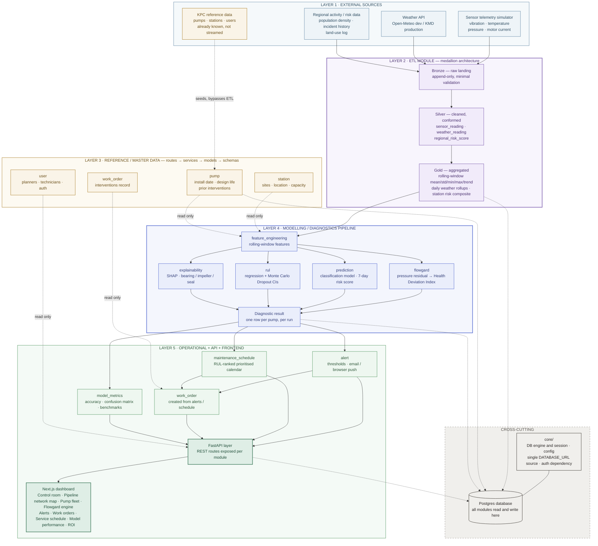

# flowgard

Multi-tenant predictive maintenance platform for fluid-transport pipeline
infrastructure (pumps/pipelines). **KPC (Kenya Pipeline Company)** is the
anchor tenant / case study — see [scripts/seed_kpc_tenant.py](scripts/seed_kpc_tenant.py).

Stack: FastAPI, SQLAlchemy 2.0, Alembic, PostgreSQL, Pydantic v2, pytest.
Python 3.11+, managed with `uv` + `pyproject.toml`.

> **Status:** structural scaffolding only. Folders, base models, service
> stubs (with correct signatures, many raising `NotImplementedError`),
> working migrations, and KPC seed data are in place. ML models, the
> Flowgard math (pressure residual / Health Deviation Index), and ETL
> transform logic are filled in module by module after this scaffold is
> reviewed.

## Architecture rules

These rules are the reason the codebase is shaped the way it is. Read this
before adding a module or a table.

### 1. Dependency direction is one-way: routes → services → models → database

- **Routes** (`routes.py`) only translate HTTP ⇄ Python: parse the request,
  call a service function, shape the response. No business logic, no direct
  DB queries.
- **Services** (`services.py`) hold all business logic and are the only
  layer that talks to the database (via SQLAlchemy `Session`).
- **Models** (`models.py`) are SQLAlchemy ORM classes. They describe schema
  only — a model never imports a service, and never imports another
  module's service.
- **Schemas** (`schemas.py`) are Pydantic v2 request/response shapes, used
  by routes to validate input and serialize output.

Nothing downstream ever imports something upstream: `models.py` doesn't
import `services.py`, `services.py` doesn't import `routes.py`.

### 2. Organize by entity/module, not by technical layer

Each business entity is a vertical slice under `app/<module>/`:

```
app/<module>/
  models.py     # SQLAlchemy tables
  schemas.py    # Pydantic request/response shapes
  services.py   # business logic, the only DB-talking layer
  routes.py     # FastAPI router, thin HTTP translation
```

Not every module has every file — a module with no HTTP surface (e.g.
`app/feature_engineering`) has no `routes.py`; one that's purely an
internal computation stage (`app/flowgard_engine`) has no `routes.py`
either, only `models.py` + `services.py` + `schemas.py`. See each module's
own docstrings for why.

### 3. Every tenant-scoped table has a `tenant_id` FK — no exceptions

[`app/core/base.py`](app/core/base.py) defines `TenantScopedMixin`, which
every tenant-scoped model inherits. It adds an indexed `tenant_id` column
(FK → `tenant.id`, `ON DELETE CASCADE`). The **one** deliberate exception is
the `tenant` table itself (`app/tenant/models.py`) — it can't scope itself
to a tenant, it *is* the tenant.

### 4. `app/etl/` is a separate top-level module, and the only writer of `sensor_reading` / `weather_reading` / `regional_risk_score`

It follows the medallion pattern:

- `bronze/` — raw landing, append-only, minimal validation.
- `silver/` — cleaned/conformed into the three canonical tables above.
- `gold/` — rolling-window aggregation, read by `app/feature_engineering`.
- `simulator/` — synthetic sensor-feed generator standing in for SCADA.

ETL never touches pump/station/user/tenant reference data — that's read
through the entity modules' own services when needed, never written by
ETL. See [app/etl/README.md](app/etl/README.md) for more detail.

### 5. Config is one object, one place

[`app/core/config.py`](app/core/config.py) defines a single
pydantic-settings `Settings` object (`settings`), reading from `.env`. No
other file calls `os.environ` / `os.getenv` — if a module needs a config
value, it imports `settings` from `app.core.config`.

### 6. One DB engine/session factory, one `DATABASE_URL`

[`app/core/db.py`](app/core/db.py) builds the single SQLAlchemy engine +
session factory from `settings.database_url`. [`migrations/env.py`](migrations/env.py)
imports the same `settings` object — it never hardcodes a second connection
string. Every module gets DB access through `get_db()` used as a FastAPI
dependency.

### 7. Tenant resolution is one dependency, and it's mandatory

[`app/core/tenancy.py`](app/core/tenancy.py) extracts `tenant_id` from the
authenticated request (via [`app/core/auth.py`](app/core/auth.py)'s JWT
decode) and hands it to route handlers as `Depends(get_current_tenant_id)`.
Every `services.py` function that touches tenant-scoped data takes
`tenant_id` as an explicit, required argument and filters every query by
it — so a route cannot query across tenants without deliberately bypassing
this dependency, and no request without valid auth can reach tenant data at
all (`get_current_user` returns 401 with no token).

## Project layout

```
app/
  core/                config, db engine/session, auth, tenancy, middleware
  tenant/               tenant config: fluid type, thresholds, branding
  station/               pump station reference data
  pump/                  pump reference data + lifecycle metadata
  user/                  users + login/auth
  work_order/            maintenance interventions
  etl/
    bronze/ silver/ gold/ simulator/     medallion ETL pipeline (see above)
  feature_engineering/    Gold -> model-ready feature vectors (services.py only)
  flowgard_engine/        pressure residual -> Health Deviation Index (no routes.py)
  prediction/             classification model + 7-day risk score
  rul/                    RUL regression + MC Dropout confidence intervals
  explainability/         SHAP values, component attribution
  alert/                  threshold-triggered alerts
  maintenance_schedule/   RUL-ranked prioritised maintenance calendar
  model_metrics/          model accuracy / confusion matrix / benchmarks
  main.py                 FastAPI app factory, router registration
migrations/               Alembic — autogenerate target is every module's models
tests/                    mirrors app/
scripts/
  seed_kpc_tenant.py      seeds KPC as tenant #1 + its 13 stations + pump fleet
```

## Getting started

```bash
uv sync                      # installs deps + creates .venv
cp .env.example .env         # edit DATABASE_URL / JWT_SECRET_KEY as needed

createdb flowgard             # or: psql -c "CREATE DATABASE flowgard;"
createdb flowgard_test        # used only by pytest

uv run alembic upgrade head
uv run python scripts/seed_kpc_tenant.py
uv run uvicorn app.main:app --reload
```

Health check: `GET /health`. Interactive API docs: `/docs`.

Run tests (needs `TEST_DATABASE_URL` reachable, see `.env.example`):

```bash
uv run pytest
```

### Docker

```bash
docker compose up --build                     # Postgres + migrate (one-shot) + api
docker compose --profile seed run --rm seed    # seed KPC (after migrate has run)
```

`api` serves on `http://localhost:8000` (`/health`, `/docs`). The `db`
service uses TCP + password auth (`flowgard`/`flowgard`) since containers
don't share the host's Unix-socket peer auth — see the note in
`.env.example`. Override `JWT_SECRET_KEY` via a `.env` file (docker compose
reads it automatically) rather than the compose file's dev default.

## Adding a new module

1. `mkdir app/<module>` with whichever of `models.py` / `schemas.py` /
   `services.py` / `routes.py` it actually needs.
2. Tenant-scoped table → inherit `TenantScopedMixin` (and usually
   `UUIDPrimaryKeyMixin`, `TimestampMixin`) from `app.core.base`.
3. `services.py` functions that touch tenant data take `tenant_id` as a
   required argument and filter every query by it.
4. If it has routes, register the router in `app/main.py`'s `ALL_ROUTERS`.
5. If it has models, add an import line in `migrations/env.py` and
   `tests/conftest.py` so Alembic/tests see the table.
6. Add `tests/<module>/test_<module>.py` mirroring the module.

## Full system diagram

The original design diagram this scaffold was built from (sources →
medallion ETL → reference data → modelling pipeline → operational/API
layer):



Notes on where this scaffold diverges slightly from the diagram: the
`Diagnostic result` box is realized as separate result tables per module
(`prediction_result`, `rul_estimate`, `health_deviation_record`,
`feature_attribution`) rather than one shared table, so each module owns
its own schema; and the Next.js dashboard is a separate frontend project,
out of scope here.
